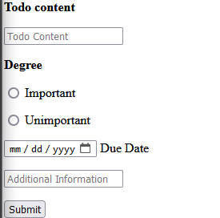
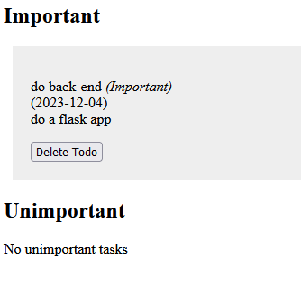

# description

this app allows you to create a simple todo list there is a form to add a new todo and a list of todos
## the form
!

## the list

You can also delete a todo by clicking on the delete button

there is some tests in the test file named test_app.py
